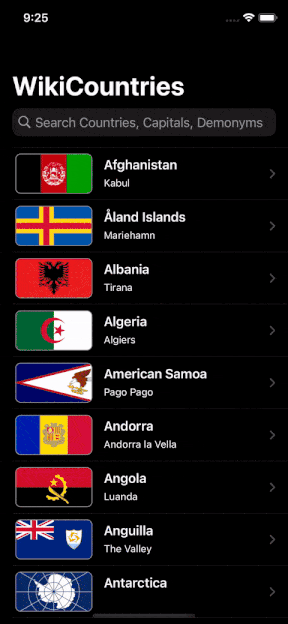

# WikiCountry
## About
WikiCountry is an app that lets you learn quick facts about countries all over the world, including each of their capital city, flag, official languages, currencies, and more.

Read further about a country via an in-app Wikipedia browser. Then let others know you’re a genius geogra-peep!

## App Store Links
* [App Store]()
* [Mac App Store](https://apps.apple.com/ca/app/wikicountry/id1569672557?mt=12)

## Concepts Utilized
* `Model-View-Controller` architecture
* `Coordinator`
* `Code Encapsulation`
* `Storyboard/AutoLayout`
* `Enums`
* `Haptic Feedback`

## Screenshots

## Context
WikiCountry was initially coded in correspondence to Paul Hudson’s "100 Days Of Swift" challenge, [day 59](https://www.hackingwithswift.com/100/59).

However, as I was able to expand WikiCountry much beyond the [course](https://www.hackingwithswift.com/100/)’s original scope, I enjoy using WikiCountry so much for being a geography fanatic, and I’d love to offer it as a gift to like-minded Apple users out there, I have decided to publish it to the App Store.

Please do your due diligence with the info provided by WikiCountry before citing any in your professional work :)

## Acknowledgement
Special thanks to the open source contribution of [Guillaume A.](https://github.com/clarknt), the concept and instruction to deploy [**coordinatior**](https://www.hackingwithswift.com/articles/71/how-to-use-the-coordinator-pattern-in-ios-apps) in Xcode projects from [Soroush Khanlou](https://khanlou.com) and [Paul Hudson](https://twitter.com/twostraws).