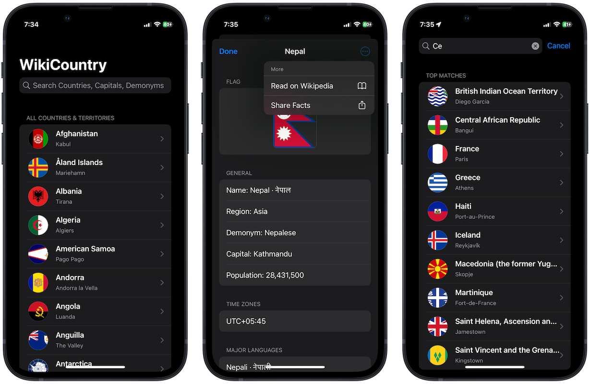
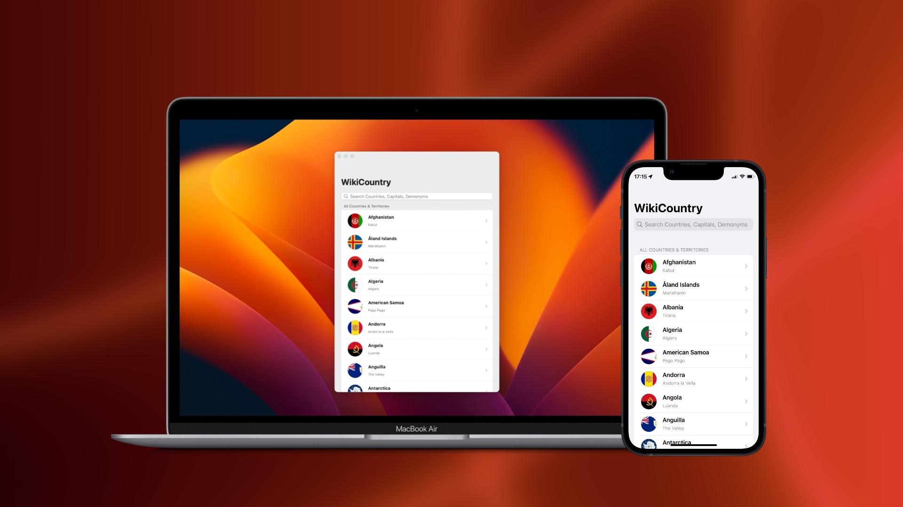

# WikiCountry
## About
WikiCountry is an app that lets you learn quick facts about countries all over the world, including each of their capital city, flag, official languages, currencies, and more!

Read further about a country via an in-app Wikipedia browser. Then let others know you’re a genius geograpeep! It's your geography Swiss-knife!

## App Store Links
* [App Store](https://apps.apple.com/ca/app/wikicountry/id1570455440) (Expired due to Developer account not renewed)
* [Mac App Store](https://apps.apple.com/ca/app/wikicountry/id1570455440) (Expired due to Developer account not renewed)

## Concepts Utilized
Addressed below are the most prominent concepts I was able to learn and implement in the app.
<table>
	<thead>
		<tr>
			<th>Concept</th>
			<th>Details</th>
		</tr>
	</thead>
	<tbody>
		<tr>
			<td>`Model-View-Controller` Architecture</td>
			<td>Codebase is structured with MVC-oriented architecture in mind, with separation of concerns</td>
		</tr>
		<tr>
			<td>`Coordinator` Design Pattern</td>
			<td>I also deployed the `Coordinator` concept introduced by <a href="https://khanlou.com" target="_blank">Soroush Khanlou</a> to separate navigation from view controllers</td>
		</tr>
		<tr>
			<td>Network Monitoring</td>
			<td>Network logic is designed to switch between online-offline internet connection status. If online, it can be used to fetch JSON from server, otherwise it can failsafe to parsing from a bundled JSON file.</td>
		</tr>
		<tr>
			<td>Dynamic image ratio</td>
			<td>The diversity of world flags is respected with dynamic flag image ratio, namely the Swiss or Nepali flags.</td>
		</tr>
		<tr>
			<td>Storyboard and Programmatic AutoLayout</td>
			<td>A mix of conventional Storyboard and programmatic AutoLayout used efficiently in the code.</td>
		</tr>
	</tbody>
</table>

## Screenshots

## Context & Disclaimer
WikiCountry was initially coded in correspondence to Paul Hudson’s "100 Days Of Swift" challenge, [day 59](https://www.hackingwithswift.com/100/59).

However, as I was able to expand WikiCountry much beyond the [course](https://www.hackingwithswift.com/100/)’s original scope, I enjoy using WikiCountry so much for being a geography fanatic, and I’d love to offer it as a gift to like-minded Apple users out there, I have decided to publish it to the App Store.

Please do your due diligence with the info provided by WikiCountry before citing any in your professional work :)

## Acknowledgement
The concept and instruction to deploy [**coordinator pattern**](https://www.hackingwithswift.com/articles/71/how-to-use-the-coordinator-pattern-in-ios-apps) is from [Soroush Khanlou](https://khanlou.com) and [Paul Hudson](https://twitter.com/twostraws).
